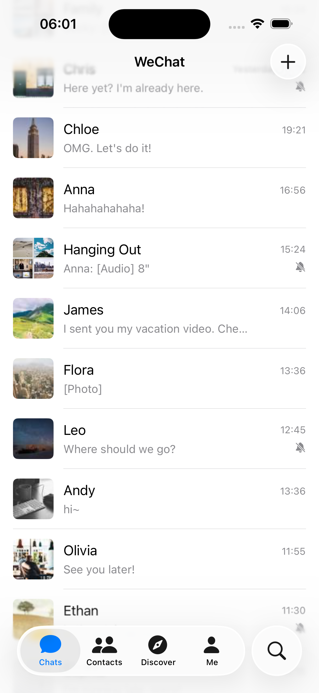
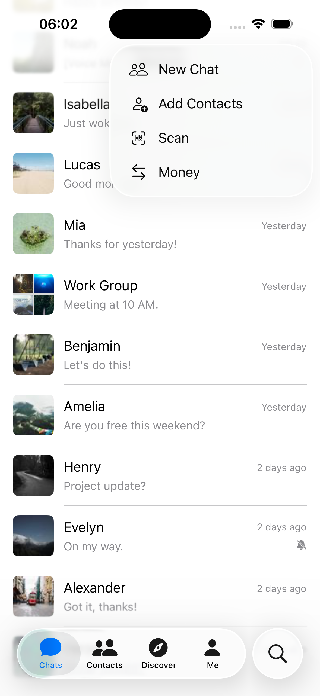
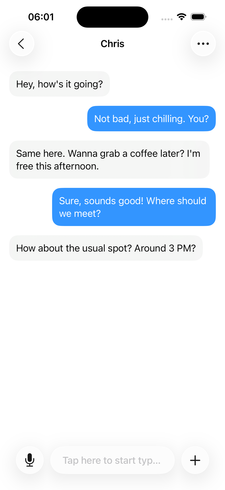

## LiquidWeChat

A proof-of-concept SwiftUI application that re-imagines the familiar WeChat experience using Apple's latest **Liquid Glass** design language introduced at WWDC 25.

Codes in this repository were mainly written by these large language models — Gemini 2.5 Pro, Claude Sonnet 4 and OpenAI o3.

|  |  |  | 
|:---:|:---:|:---:|
| 主界面 | + 菜单 | 聊天 |
